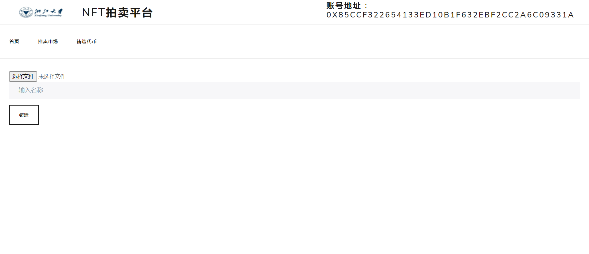

# NFTAuction

浙江大学区块链课程大作业

## 运行代码

### 下载truffle

```
npm install -g truffle
```

### 下载ganache

直接在官网下载，并且将端口改为8545，并将配置文件添加到ganache中

### 在浏览器中安装metamask插件

浏览器中安装插件，并且连接到本地8545端口，并将ganache中的几个账户导入到metamask账户中

### 将代码克隆到本地

```
git clone git@github.com:Kona-Sumon/NFTAuction.git
```

### 下载依赖

```
cd NFTAuction
yarn
```

### 编译与部署

```
truffle compile
truffle migrate
```

### 开启项目

```
yarn start
```

## 运行截图

### 铸造代币




### 显示：


### 出售：


更多功能期待您的探索！